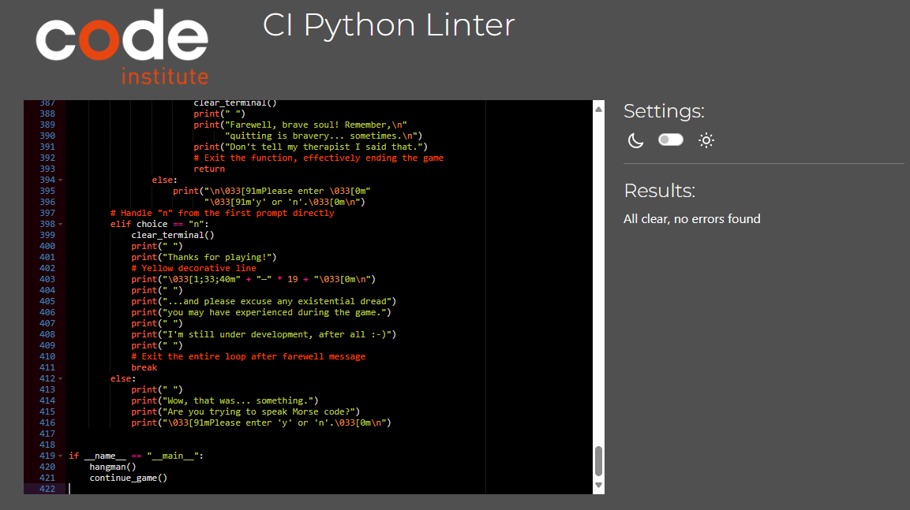
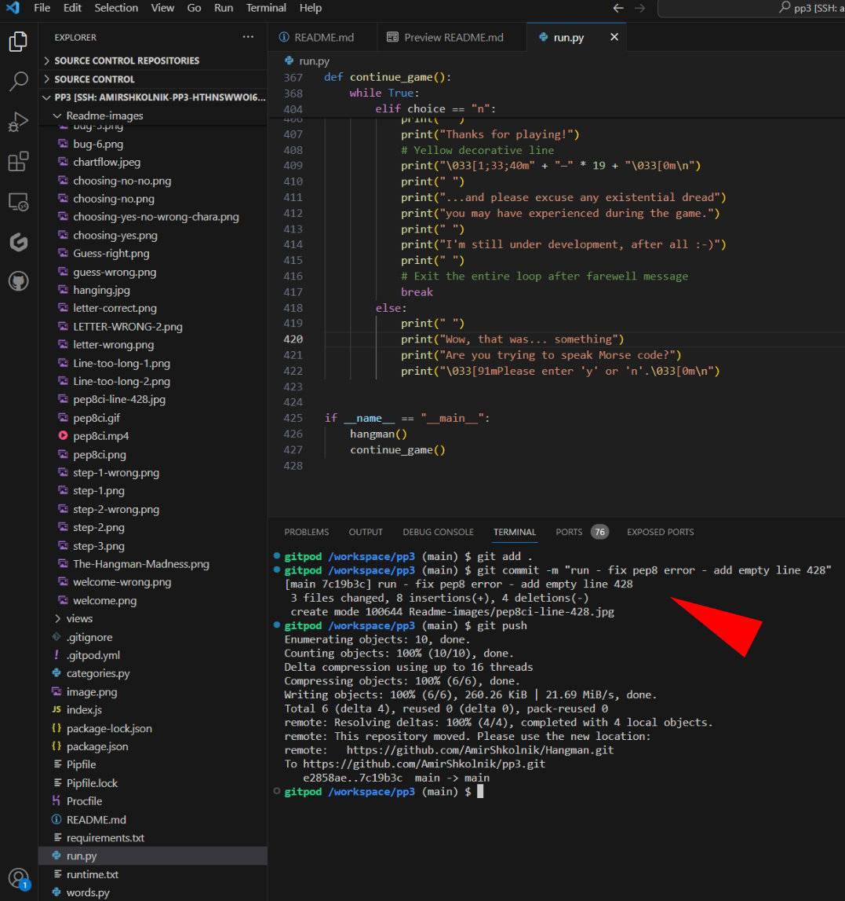
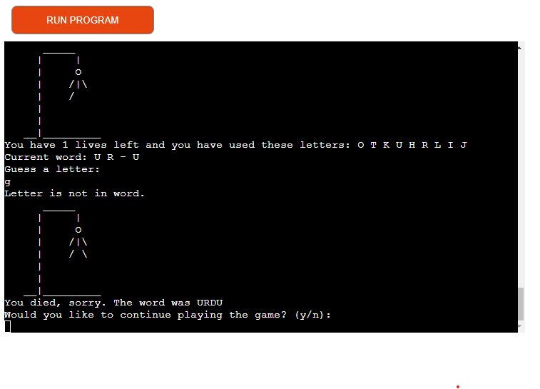

Welcome To The Hangman Madness!
-------------------------------

Imagine being stuck in a car during a snowstorm, the icy wind howling outside while you sit snugly inside. 

Boredom begins to creep in, but then you remember the Hangman Madness game on your phone. With two levels 
to choose from, you opt for the daring challenge of Hard mode, ready to test your skills.

Scrolling through the categories, you select "Languages" and begin guessing letters, trying to uncover the hidden word. 
Each incorrect guess brings a moment of suspense, but also a hint of laughter as you try to outsmart the hangman.

Despite the freezing temperatures outside, the game keeps you entertained and focused. Finally, after a series of 
amusing guesses, you unveil the word "Esperanto," feeling a sense of triumph in the midst of the storm.

As you wait for the snowplows to clear the highway, you realize that even in the chilliest of situations, 
a little game can bring warmth and joy.

The live link can be found here - [The Hangman Madness](https://play-hangman-3f577e016fa9.herokuapp.com/)

## CONTENTS

* [How To Play](#how-to-play)

* [User Experience](#user-experience-ux)
  * [Flow Chart](#flow-chart)
  * [User Stories](#user-stories)
    *[First Time Visitor Goals](#first-time-visitor-goals)
    *[Returning Visitor Goals](#returning-visitor-goals)

* [Design](#design)
  * [Colour Scheme](#colour-scheme)
  * [Typography](#typography)
  * [Imagery](#imagery)
  * [Layout](#layout)

* [Features](#features)
  * [Welcome](#welcome)
  * [Step 1](#step-1)
  * [Step 2](#step-2)
  * [Step 3](#step-3)
  * [Game Over](#game-over)

* [Future Implementations](#future-implementations)

* [Technologies Used](#technologies-used)
  * [Languages Used](#languages-used)
  * [Frameworks, Libraries & Programs Used](#frameworks-libraries--programs-used)

* [Deployment & Local Development](#deployment--local-development)
  * [Deployment](#deployment)
  * [Local Development](#local-development)
    * [How to Fork](#how-to-fork)
    * [How to Clone](#how-to-clone)

* [Testing](#testing)

* [Bugs](#bugs)
  * [Solved Bugs](#solved-bugs)
  * [Known Bugs](#known-bugs)
  
* [Credits and Resources Used](#credits-and-resources-used)
  * [Youtube Channels](#youtube-channels)
  * [Content](#content)
  * [Media](#media)
  * [Acknowledgments](#acknowledgments)

---

How To Play
-----------

Press the "Ready, Set, Guess" button to start the game.

After the welcome message, enter your name. It must be at least 3 letters or numbers.

Choose your level of adventure:

  - Easy: 8 lives - perfect for hangman beginners.
  - Hard: 4 lives - for the daring souls who seek a challenge.

Select your favorite category out of 5 options:

  1. Animals
  2. Countries
  3. Flowers
  4. Languages
  5. Fruits

Let the guessing game begin at step 3! Based on your level selection, you'll have either 4 or 8 
lives. Guess the letters to reveal the hidden word. Incorrect guesses will display the hangman in red and decrease your remaining lives. Correct guesses will reveal the letters in the right places.

The game ends when you run out of lives or correctly guess the word. You'll be announced the right word and given the option to continue playing or not.

If you choose to keep playing, the game will start over. If you choose not to continue, you'll see a goodbye message. You can restart the game by clicking the "Ready, Set, Guess" button if you change your mind.

### Happy playing! Enjoy the challenge and have fun guessing the words!

The live link can be found here - [The Hangman Madness](https://play-hangman-3f577e016fa9.herokuapp.com/)

---

User Experience (UX)
--------------------

### Flow Chart

The [flowchart](Readme-images/chartflow.jpeg) below illustrates the sequential steps of the hangman guessing game, depicting how users can navigate through the game and the available options at each stage.

### User Stories

### First Time Visitor Goals

- As a first-time visitor, I want to participate in an online hangman game and test my knowledge in various categories such as animals, countries, flowers, languages, and fruits.

- I want the ability to play the game anytime, anywhere, whether I'm stuck in traffic or waiting for an appointment.

- I expect the website to adjust to my device's screen size, ensuring a seamless gaming experience.

- I desire the website to be easy to navigate, allowing me to quickly select my preferred level and category.

- I would like to view my score after each game to gauge my progress and skill level.

### Returning Visitor Goals

- As a returning visitor, I aim to further challenge myself and expand my knowledge by encountering new words and categories in the hangman game.

- I want to explore various topics related to language, such as idioms, slang, and famous quotes, to enhance my linguistic understanding.

- I am interested in achieving high scores and tracking my progress over time to see how my hangman skills improve with each visit.

- I look forward to engaging with the game's features and enjoying the fun and educational experience it offers.

---

Design
------

As the application operates within the terminal, there isn't a conventional user interface design.

The deployed application runs on Heroku within a simulated terminal environment, showcasing the project's functionality. The design of this mock terminal is integrated into the template provided by Code Institute.

### Color Scheme

- I've used #f7c331 and #f7882f as the primary and secondary colors for the headline.

- For the button display and design, I've utilized #f7c331, #000000, and #808080.

- To highlight positive comments and display the correct word, I've employed #00ff00.

- For displaying the hangman animation and highlighting negative comments, I've opted for #ff0000.

- Lastly, I've used #ffff00 to highlight correctly guessed letters.

### Typography

### Headline

[Google Fonts](https://fonts.google.com/) was used to import the chosen fonts for use in the site.

I chose the [Lemon Google Fonts](https://fonts.google.com/specimen/Lemon?query=lemon&sort=alpha) for the headline font because it's a personal preference of mine. I find that the font has a visually appealing appearance that I personally enjoy.

Furthermore, I believe that the Lemon font fits perfectly with the style and aesthetic of the hangman game. Its clean and modern look adds a touch of sophistication while still maintaining a playful vibe, which aligns well with the overall theme of the quiz. Overall, I selected the Lemon Google Fonts because I found it aesthetically pleasing, easy to read, and fitting for the style and tone of the quiz.

Sans Serif is used as a backup font, in case for any reason the [Lemon](https://fonts.google.com/specimen/Lemon?query=lemon&sort=alpha) font isn't being imported into the site correctly.

### Imagery

I selected Mariano Ruffas' [Ljus manniskor konst kreativ](https://www.pexels.com/sv-se/foto/ljus-manniskor-konst-kreativ-169406/) image from Pexels as the website's background due to its thematic relevance to the hangman game.

By integrating an image of an art exhibition featuring hanging figures as the background, my goal was to immerse users in an atmosphere of excitement and intrigue, fostering an engaging and immersive experience.

This choice aims to evoke a sense of adventure and discovery synonymous with the hangman game, enriching its overall theme and appeal.

Ultimately, the artwork's background enhances user engagement, evoking the sensation of embarking on a thrilling journey through the heart of the game.

### Layout

The site is a single page with 5 steps/sections:
  - Welcome area
  - Step 1: Choose Your Level of Adventure
  - Step 2: Let's explore the world of letters
  - Step 3: Let the guessing game begin
  - Game Over

---

Features
--------
### Welcome

The Hangman Madness game features a welcoming message followed by a brief note explaining the purpose of the application. Users are prompted to enter their username to personalize their gaming experience. 

Additionally, the game presents a visual representation of the hangman illustration, setting the stage for an immersive and engaging word-guessing adventure.

#### Username Validation

Users are required to input a username with at least 3 characters. If the username does not meet this requirement, a message will display prompting the user to correct it.

### Step 1 
### Choose Your Level of Adventure!

After choosing a username, players will proceed to step 1 of the hangman game. Here, they will receive a warm greeting and be prompted to select their desired difficulty level. They have two options:

 - Easy mode, offering 8 lives, perfect for beginners.
 - Hard mode, with 4 lives, designed for those seeking a challenge.

### Error Handling for Level Selection:

If the user fails to choose one of the two levels, an error message will prompt them to select again. Upon choosing a character, the user will then be prompted to select a number. If the chosen number is not 1 or 2, the user will be asked to select either 1 or 2 to proceed.

### Step 2 
### Let's explore the world of letters!

The hangman game offers an array of exciting features for players to enjoy. Once a level is selected, users progress to step number 2, where they have the opportunity to choose from five captivating categories:
 1. Animals
 2. Countries
 3. Flowers
 4. Languages
 5. Fruits

With a diverse range of categories, players can tailor their gaming experience to their interests, ensuring endless fun and challenges as they embark on their hangman adventure.

### Error Handling for Category Selection

If the user fails to choose one of the 5 categories, an error message will prompt them to select again.

#### Character vs. Number Input Handling:

If the user enters a character instead of a number, a message will prompt:
"Is that character part of a secret code? [Username], please enter a number."

#### Numerical Range Validation:

If the user enters a number that is not between 1 and 5, the following message will be presented:
"I see you're struggling with your keyboard skills. Please enter a number between 1 and 5."

### Step 3 
### Let the guessing game begin!

In Step 3 of the game, users are presented with the chosen category and the remaining lives based on their selection in Step 2. Upon entering the first letter after the prompt "Guess a letter," the game begins.

### Error Handling for Letter Guessing

If the user fails to choose a letter, a new screen will open, and an error message will prompt them to select again with the following message: "The keyboard gremlins just ate your character! Please choose a valid one before they attack again."

### Correct Letter Highlighting and Confirmation

- When the user guesses a correct letter, it will be displayed and highlighted in yellow both in the "Current word" and "Used letters" sections.

- A message will prompt: "The eagle has landed! Or was it a penguin? No matter, you guessed right!"

- The user will be informed about how many lives are left, providing them with crucial information to strategize their next moves.

#### Wrong Letter Display

- When the user guesses a wrong letter, it will be displayed under "Used Letters," accompanied by a message saying "Yikes! Swing and a miss..."

- The hangman will then appear on the screen, illustrating the progression of the game as each wrong guess is made.

- The user will be informed about how many lives are left, providing them with crucial information to strategize their next moves.

### Game Over

#### Wrong Guess
- If the user couldn't guess the word and is running out of lives, a message will prompt: "Aw, shucks! Looks like your brain went on vacation with the penguins."

- The correct word will be displayed, highlighted in light green color. For example: "The word was BEE."

- The user will be given the option to continue playing or not: "Ready for another round? (y/n) It's like potato chips, you can't have just one."

#### Correct Guess

If the user correctly guesses the word, a message will prompt displaying the correct word. They will then be given the option to play again or quit the game.

#### Choosing No (Quit)

If the user decides not to continue playing, the screen will clear, and a thank you message will appear.

#### Choosing Yes (Continue Playing)

This feature allows users to easily restart the game or exit with a humorous touch.

If the user chooses "yes":

- The screen will clear.
- A funny message will appear, asking if they made the right decision.
- They need to choose again between "yes" or "no".

If they choose "yes", the screen will clear, and the game will start all over again.

#### Choosing No (Quit)

If they choose "no", the screen will clear, and a goodbye message will appear.

### Error Handling for Category Selection

If the user fails to choose 'y' or 'n' an error message will prompt them to select again.

---
Future Implementations
--------------------------

- Users can track their results/guesses.
- Establish difficulty levels based on the user's results.
- Include additional difficulty levels.
- Introduce more categories.
- Enable sound playback.
- Implement an option for two players to play together or against the computer. Each player receives a word and has the opportunity to guess on their turn. The first to guess correctly wins.

---

Technologies Used
-----------------

### Languages Used

This website was created using the following languages:

- Python
- JavaScript
- HTML5
- CSS

### Frameworks, Libraries & Programs Used

- [Am I Responsive](https://ui.dev/amiresponsive?url=https://amirshkolnik.github.io/JungleQuiz/) To show the website image on a range of devices.

- [Responsinator](http://www.responsinator.com/?url=amirshkolnik.github.io%2FJungleQuiz) To show the website image on a range of devices.

- [Affinity Photo](https://affinity.serif.com/en-gb/photo/) - Photo editor software.

- [Flow Chart](https://lucid.app/) - Lucid Visual Collaboration Suite is a platform for creating and sharing visuals, such as diagrams, whiteboards, and scale models.

- [Github](https://github.com/) - To save and store the files for the website.

- [GitPod](https://gitpod.io/) - IDE used to create the site.

- [Google Fonts](https://fonts.google.com/) - To import the fonts used on the website.

- [Google Developer Tools](https://developers.google.com/web/tools) - To troubleshoot and test features, solve issues with responsiveness and styling.

- [TinyPNG](https://tinypng.com/) To compress images

- [Favicon Creator](https://realfavicongenerator.net/) To create favicon.

Deployment & Local Development
------------------------------

### Deployment

The live link can be found here - [The Hangman Madness](https://play-hangman-3f577e016fa9.herokuapp.com/)

This project was deployed using the Code Institute's mock terminal for Heroku, and the live link can be found here The Battleship Game.

These steps were taken for the deployment:

- Create an account or log in to Heroku.
- On the dashboard, in the right corner click the button that says "New" and choose "Create New App".
- Pick a name of the app. The name has to be unique because it can't match any other name being used.
- Select your region, United States or Europe.
- Add payment method if needed.
- Click "Create App".
- On the menu at the top of the page, go to the Settings Tab.
- Scroll down to Config Vars and click "Reveal Config Vars".
- Add a new Config Var and enter PORT in the keybox and 8000 in the valuebox.
- Under Config Vars you will find Buildpacks.
- Click "Add Buildpacks".
- Select python.
- Repeat this step but select nodejs.
- Important to know: The python has to be picked before the nodejs, if it is not in order 6you can change the order by click and drag to correct the order.
- Scroll back to the top of the page, to the menu and go to the Deploy Tab.
- Select GitHub as the deployment method and confirm.
- Search for you repository name and connect that.
- Scroll down to the bottom of the page and there you can choose if you want the deploys to be Automatic or Manually. The Manually deployed branches needs redepolying each time the repository is updated.
- Click "View" to see the live site.

### How to Fork

To fork the repository:

1. Log in (or sign up) to Github.
2. Go to the repository for this project - [The Hangman Madness](https://github.com/AmirShkolnik/Hangman).
3. Click the Fork button in the top right corner.

### How to Clone

To clone this repository follow the below steps: 

1. Locate the repository at this link [The Hangman Madness](https://github.com/AmirShkolnik/Hangman). 
2. Under **'Code'**, see the different cloning options, HTTPS, SSH, and GitHub CLI. Click the prefered cloning option, and then copy the link provided. 
3. Open **Terminal**.
4. In Terminal, change the current working directory to the desired location of the cloned directory.
5. Type **'git clone'**, and then paste the URL copied from GitHub earlier. 
6. Type **'Enter'** to create the local clone. 

## Testing

While running the code through [pep8ci](https://pep8ci.herokuapp.com/), my mentor and I noticed a peculiar occurrence. Occasionally, when copying the raw code from GitHub, it yields no errors, as demonstrated in the attached video. However, at other times, it shows 'Results: 427: W292 no newline at end of file'. Despite adding a new empty line 428 multiple times and pushing it to GitHub, it never reflected the change. 

At this stage of my coding experience, I am unable to explain this inconsistency.

- Testing the app's capability to handle incorrect inputs by providing invalid inputs throughout the application.

- I have tested the deployed application on Google Chrome, Safari, Firefox, and Microsoft Edge. I can confirm that the application functions properly on all of these web browsers

- I have validated the HTML, CSS, and JavaScript code on W3C, and the results were clean with no errors.

- I tested the game in my local terminal and in the Code Institute Heroku terminal, and no errors were displayed.

Bugs
----

### Solved Bugs

### Bug nr 1.

When I tested the code on PEP8CI, it kept showing an error message saying, 'continuation line under-indented for visual indent.' The problem was that my code lines were too long, more than 80 characters. 

To fix it, I had to change how I structured those long lines. 

Got inspired by this article: https://stackoverflow.com/questions/41561952/i-get-continuation-line-under-indented-for-visual-indent-error

Solution:

### Before

### After

### Bug Nr 2.

After deploying the hangman game, the first test revealed that it started with 'You have 7 lives left...' when it should have been 8 lives instead of 7.

### Bug Nr. 3
     
The category option functions in VS Code, BUT it only displays words from the 'fruits' category.

The issue stemmed from the code I initially wrote as the default before adding more categories, and I forgot to change it.

#### Lines 289 -294
    def chosen_category_word(chosen_list):
    word = random.choice(chosen_list)
    while '-' in word or ' ' in word:
        # randomly choose a word fron the chosen category
        word = random.choice(chosen_list)
    return word.upper()

### Bug Nr. 4

Issue: The user is supposed to select a category number between 1 and 5, but if they choose a letter or symbol, an error is displayed.

Resolution: Modify the function "choose_category()".

The code will continually prompt the user for input until a valid numeric choice between 1 and 5 is entered.

If the input cannot be converted to an integer or falls outside this range, appropriate error messages will be displayed. Once a valid choice is made, the chosen category and its associated word list will be returned.

### Before

### After

### Bug Nr. 5

The hangman drawing is not showing the whole body when the player ran out of guesse and loses. The solution was changing the number of lives from 7 to 8.

## Before

## After

### Bug Nr. 6

Problem:
When adding levels to the beginning of the game, the display became synchronized with the hard level, resulting in only 4 lives being displayed. This occurred because I intended for the hangman display to progress twice as fast, with 2 steps for each mistake. After adding an easy option with 8 lives nothing was synchronized and on top of that I forgot to include the return stages_to_display on line 198.

Solution:

To address this issue, I added the following code:

 #### Lines 185-198
    if chosen_level == "Easy - 8 lives: Perfect for hangman beginners":
        display_per_mistake = 1  # Display two stages per mistake
    # Easy level - Display 1 stage per mistake
    # Hard level - Display 2 stage per mistake
    else:
        display_per_mistake = 2
    # Calculate the number of stages to display for the current mistake
    stages_to_display = min(mistakes *
                            display_per_mistake,
                            len(hangman_stages) - 1)
    print("\033[91m" + hangman_stages
          [stages_to_display] + "\033[0m")
    return stages_to_display

This solution ensures that the hangman display progresses appropriately according to the chosen level, displaying the correct number of stages per mistake.

### Known Bugs

One user complained about weird symbols appearing on the screen during step 3 while using the Firefox browser. I tested it myself manually on a few devices using Mozilla Firefox, and the test was free of errors and symbols. 

I must check it more deeply in the future to ensure that the game functions properly on all browsers and devices.

Credits and Resources Used
-----------------------------

Great websites for general knowledge, training, and practical solutions.

- [W3Schools](https://www.w3schools.com/) 
- [Stack Overflow](https://stackoverflow.com/)
- [JSchallenger](https://www.jschallenger.com/)

The following article was very helpful in understanding the "continuation line under-indented for visual indent" error:
- [Stack Overflow](https://stackoverflow.com/questions/41561952/i-get-continuation-line-under-indented-for-visual-indent-error)

The following article was very helpful in understanding What does if __name__ == "__main__": do?

- [Name_Main](https://stackoverflow.com/questions/419163/what-does-if-name-main-do) 

### Youtube Channels

- [Game of Hangman](https://www.youtube.com/watch?v=cJJTnI22IF8) - How to Code a Game of Hangman... The EASY Way!! (Beginner Python Tutorial).

- [Hangman Display](https://www.youtube.com/watch?v=uoXiDwLkqzU&t=367s) - Code Challenge #1: Display Hangman (Beginner Python Code).

### Content

I utilized ChatGPT to gather words for different categories. All the comments were written by myself, and I used ChatGPT to correct my grammar and spelling errors.

### Media

I used images, vectors, and illustrations from the following websites with thanks to the amazing photographers who created them.:

#### Pexels

- Background Image - [Mariano Ruffa](https://www.pexels.com/sv-se/foto/ljus-manniskor-konst-kreativ-169406/)
  
Acknowledgments
---------------

- My mentor, Antonio Rodriguez, for his support and guidance.

- Thank you to the Code Institute Slack community for their quick responses and helpful feedback!